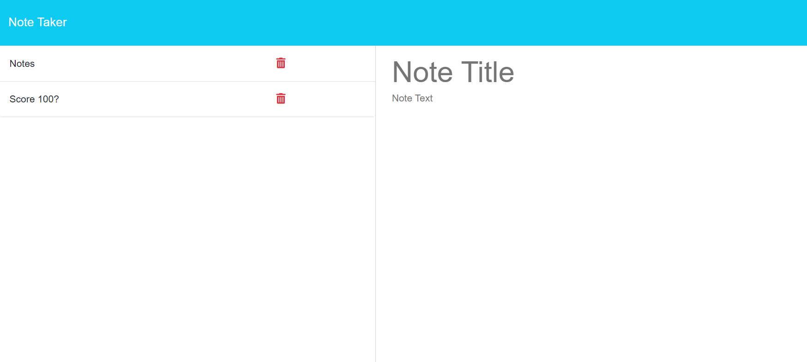

# Note Taker

## Description

The Note Taker is an Express.js application that allows users to write and save notes. This application provides a simple interface for organizing thoughts and tracking tasks, making it ideal for small business owners and anyone needing to manage their notes efficiently.

## Table of Contents

- [Features](#features)
- [Technologies Used](#technologies-used)
- [Installation](#installation)
- [Usage](#usage)
- [Examples](#examples)
- [Repo](#repo)
- [License](#license)

## Features

- Users can create, save, and view notes.
- The application provides a user-friendly interface with a landing page and a notes page.
- Notes are stored in a JSON file, ensuring data persistence.
- Each note has a unique ID for easy management.
- Includes functionality to delete notes.

## Technologies Used

- **Express.js**: Web framework for Node.js to build the back end.
- **Node.js**: Backend runtime for the application.
- **File System (fs)**: To read and write the notes stored in a JSON file.
- **UUID**: To generate unique IDs for each note.

## Installation

To install the necessary dependencies for this application, run the following command:

```bash
npm install
```

## Usage

To use the Note Taker application, follow these steps:
- Clone the repository to your local machine.
- Navigate to the project directory in your terminal.
- Run the following command:

```bash
npm start
```

- Open your browser and go to `http://localhost:3000` to access the application.
- Use the interface to create, save, and manage your notes.

## Examples

Here’s an example of the Note Taker interface:



## Repo

[GitHub Repo](https://github.com/briansotolago/Note-Taker)

## License

[](https://opensource.org/licenses/MIT)
